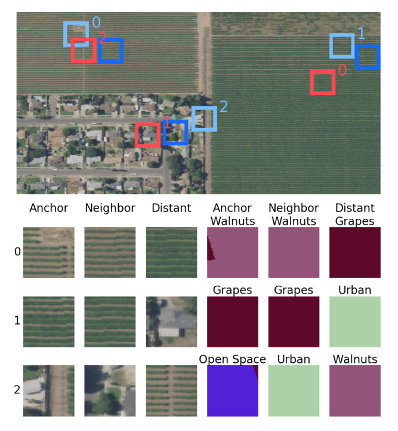

# torchgeo-experiments
Some TorchGeo Experimental Ideas and Training/Inference Code

### Installation

```bash
curl -LsSf https://astral.sh/uv/install.sh | sh
uv sync
source .venv/bin/activate
```


### Implemented Methods

#### Tile2Vec



[Tile2Vec](https://arxiv.org/abs/1805.02855) is a self-supervised learning method for satellite imagery that use a triplet loss to learn useful representations.

The original Tile2Vec [code](https://github.com/ermongroup/tile2vec) has been cleaned and refactored into PyTorch Lightning Modules and DataModules for easier training and inference. The original code used a custom implementation of ResNet18 which is randomly initialized and trained from scratch. This implementation allows for any [timm](https://github.com/huggingface/pytorch-image-models) backbone with pretrained weights to be used.

```bash
python train.py --config configs/tile2vec.yaml
```

